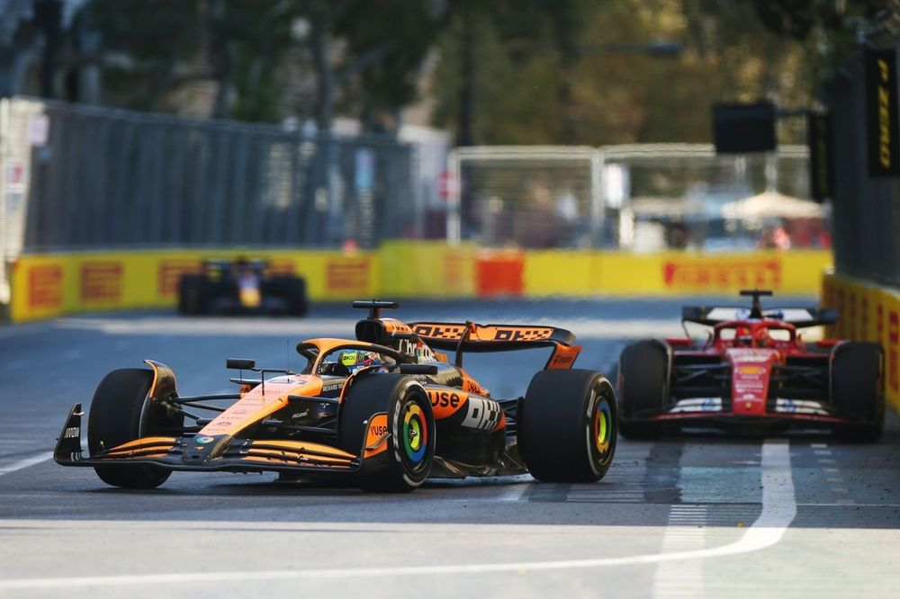
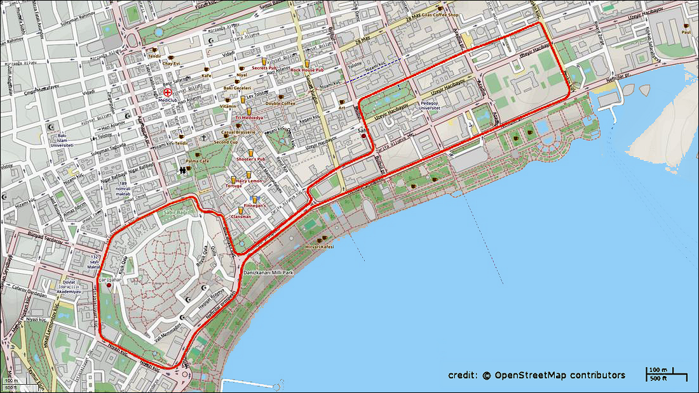
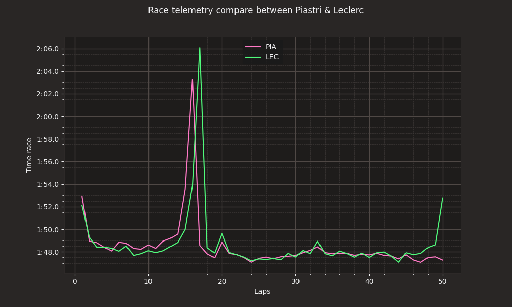
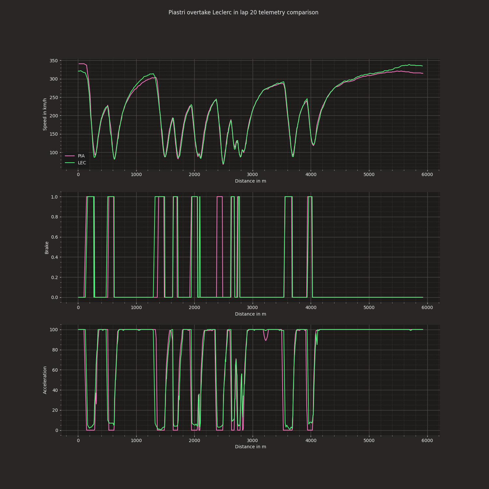

<h1 align="center" id="title">F1 Telemetry Analysis</h1>

This is a simple code for analyzing the race battle between Piastri and Leclerc in the 2024 Azerbajian Grand Prix.

<h2>Project Screenshots:</h2>

<h2>Project Article:</h2>

You can checkout the Anlysis article on my website at the link below: 

https://www.danielcejudo.com/that-s-why-i-love-data-f1-telemetry-analysis.html

<h2>💻 Built with</h2>

Technologies used in the project:

*   Python
*   Fastf1
*   MatplotLib